Company Balance Sheet Analysis
========================================================
author: Karan Sharma
date: 15th November 2016
autosize: true

List of Companies
========================================================

10k forms scraped from: <https://www.sec.gov/>.

- $AMZN (Amazon)
- $AAPL (Apple)
- $PEP (Pepsi)
- $FB (Facebook)
- $GM (General Motors)

Setting up things
========================================================


```r
# To parse XML documents
library(XBRL)
# To visualize results
library(plotly)
library(ggplot2)
# To analyze balance sheets
library(finstr)
# Data munging
library(dplyr)
# HTML Tables
library(htmlTable)
setwd("~/Work/BigDataAssignments/secgovanalyze")
```

Analyzing Amazon
========================================================


```r
#AMZN forms
amzn_url2015<-'http://localhost:8000/amzn/2015/amzn-20141231.xml'
amzn_url2016<- 'http://localhost:8000/amzn/2016/amzn-20151231.xml'
old_o <- options(stringsAsFactors = FALSE)
amzn_2015 <- xbrlDoAll(amzn_url2015)
amzn_2016 <- xbrlDoAll(amzn_url2016)
options(old_o)
amzn2015 <- xbrl_get_statements(amzn_2015)
amzn2016 <- xbrl_get_statements(amzn_2016)
```

Amazon 10K in 2015
========================================================

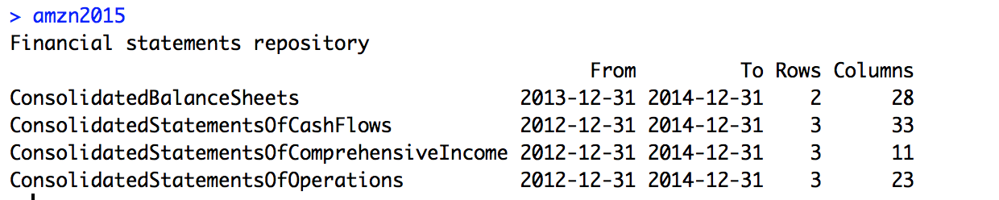

## Amazon 10K in 2016

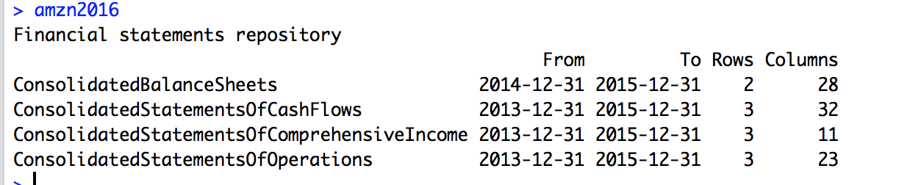

Merge the result!
========================================================


```r
amzn <- merge(amzn2015,amzn2016)
amznSOP <- merge(amzn2015$ConsolidatedStatementsOfOperations,amzn2016$ConsolidatedStatementsOfOperations)
amznBalanceSheet<- merge(amzn2015$ConsolidatedBalanceSheets,amzn2016$ConsolidatedBalanceSheets)
amznCashflow <- merge(amzn2015$ConsolidatedStatementsOfCashFlows,amzn2016$ConsolidatedStatementsOfCashFlows)
```
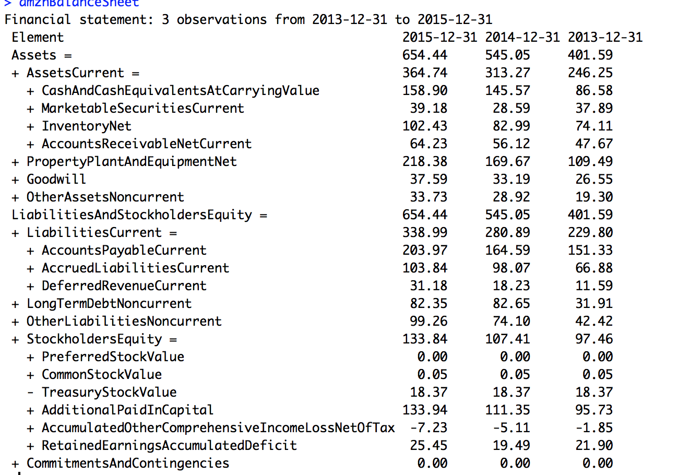

Financial ratios!
========================================================
It's the ratio of current assests / current liabilities.  


```r
amznBalanceSheet %>% transmute(
  date = endDate, 
  CurrentRatio = AssetsCurrent / LiabilitiesCurrent
)
```

```
        date CurrentRatio
1 2013-12-31     1.071584
2 2014-12-31     1.115276
3 2015-12-31     1.075961
```

`Inference : Amazon consistently had a ratio of 1.0 or greater which indicates that Amazon possesed more assets than liablities, which is a good sign for company's growth.`

Visualize Revenue and Expenditure!
========================================================
Consolidated Statement of Operations.
This dataset highlights the Revenue earned by Amazon v/s amount spent in activities like 
`marketing`, `admnistration expense`, `cost of goods and services sold`, `amazon fulfillment expense` and other `ops costs`.


```r
amznSOP_simple <- expose( amznSOP,
`Revenue` = 'SalesRevenueNet',
`Expenditure` = 'CostsAndExpenses'
)

print(amznSOP_simple, html = TRUE, big.mark = ",", dateFormat = "%Y")
```

<table class='gmisc_table' style='border-collapse: collapse; margin-top: 1em; margin-bottom: 1em;' >
<thead>
<tr>
<th style='border-bottom: 1px solid grey; border-top: 2px solid grey;'> </th>
<th style='border-bottom: 1px solid grey; border-top: 2px solid grey; text-align: center;'>2015</th>
<th style='border-bottom: 1px solid grey; border-top: 2px solid grey; text-align: center;'>2014</th>
<th style='border-bottom: 1px solid grey; border-top: 2px solid grey; text-align: center;'>2013</th>
<th style='border-bottom: 1px solid grey; border-top: 2px solid grey; text-align: center;'>2012</th>
</tr>
</thead>
<tbody>
<tr>
<td style='text-align: left;'><strong>Net Income (Loss) Attributable to Parent</strong></td>
<td style='text-align: right;'><strong>     596</strong></td>
<td style='text-align: right;'><strong>   -241</strong></td>
<td style='text-align: right;'><strong>    274</strong></td>
<td style='text-align: right;'><strong>    -39</strong></td>
</tr>
<tr>
<td style='text-align: left;'>&nbsp;&nbsp;&nbsp;Revenue</td>
<td style='text-align: right;'> 107,006</td>
<td style='text-align: right;'> 88,988</td>
<td style='text-align: right;'> 74,452</td>
<td style='text-align: right;'> 61,093</td>
</tr>
<tr>
<td style='text-align: left;'>&nbsp;&nbsp;&nbsp;Expenditure</td>
<td style='text-align: right;'>-104,773</td>
<td style='text-align: right;'>-88,810</td>
<td style='text-align: right;'>-73,707</td>
<td style='text-align: right;'>-60,417</td>
</tr>
<tr>
<td style='border-bottom: 2px solid grey; text-align: left;'>&nbsp;&nbsp;&nbsp;OtherNetIncomeLoss_</td>
<td style='border-bottom: 2px solid grey; text-align: right;'>  -1,637</td>
<td style='border-bottom: 2px solid grey; text-align: right;'>   -419</td>
<td style='border-bottom: 2px solid grey; text-align: right;'>   -471</td>
<td style='border-bottom: 2px solid grey; text-align: right;'>   -715</td>
</tr>
</tbody>
</table>

`Inference: Amazon as a company is increasing it's revenue every year, but this is only possible with greater expenditure. `
`Bottomline: More the expenditure more is the revenue`

Visualizing Cash Flow!
========================================================
This dataset highlights how the money is used in Amazon.


```r
amznCashflow_simple <- expose( amznCashflow,
`Ops Activities` = 'NetCashProvidedByUsedInOperatingActivities',
`Investing` = 'NetCashProvidedByUsedInInvestingActivities',
`Financing` = 'NetCashProvidedByUsedInFinancingActivities'
)
print(amznCashflow_simple, html = TRUE, big.mark = ",", dateFormat = "%Y")
```

<table class='gmisc_table' style='border-collapse: collapse; margin-top: 1em; margin-bottom: 1em;' >
<thead>
<tr>
<th style='border-bottom: 1px solid grey; border-top: 2px solid grey;'> </th>
<th style='border-bottom: 1px solid grey; border-top: 2px solid grey; text-align: center;'>2015</th>
<th style='border-bottom: 1px solid grey; border-top: 2px solid grey; text-align: center;'>2014</th>
<th style='border-bottom: 1px solid grey; border-top: 2px solid grey; text-align: center;'>2013</th>
<th style='border-bottom: 1px solid grey; border-top: 2px solid grey; text-align: center;'>2012</th>
</tr>
</thead>
<tbody>
<tr>
<td style='text-align: left;'><strong>Cash and Cash Equivalents, Period Increase (Decrease)</strong></td>
<td style='text-align: right;'><strong> 1,333</strong></td>
<td style='text-align: right;'><strong> 5,899</strong></td>
<td style='text-align: right;'><strong>   574</strong></td>
<td style='text-align: right;'><strong> 2,815</strong></td>
</tr>
<tr>
<td style='text-align: left;'>&nbsp;&nbsp;&nbsp;Ops Activities</td>
<td style='text-align: right;'>10,728</td>
<td style='text-align: right;'> 7,324</td>
<td style='text-align: right;'> 4,927</td>
<td style='text-align: right;'> 4,258</td>
</tr>
<tr>
<td style='text-align: left;'>&nbsp;&nbsp;&nbsp;Investing</td>
<td style='text-align: right;'>-6,450</td>
<td style='text-align: right;'>-7,607</td>
<td style='text-align: right;'>-7,102</td>
<td style='text-align: right;'>-3,595</td>
</tr>
<tr>
<td style='text-align: left;'>&nbsp;&nbsp;&nbsp;Financing</td>
<td style='text-align: right;'>-3,763</td>
<td style='text-align: right;'> 4,432</td>
<td style='text-align: right;'>  -539</td>
<td style='text-align: right;'> 2,259</td>
</tr>
<tr>
<td style='border-bottom: 2px solid grey; text-align: left;'>&nbsp;&nbsp;&nbsp;OtherCashAndCashEquivalentsPeriodIncreaseDecrease_</td>
<td style='border-bottom: 2px solid grey; text-align: right;'>  -374</td>
<td style='border-bottom: 2px solid grey; text-align: right;'>  -310</td>
<td style='border-bottom: 2px solid grey; text-align: right;'>   -86</td>
<td style='border-bottom: 2px solid grey; text-align: right;'>   -29</td>
</tr>
</tbody>
</table>

`Inference: Amazon spends most of the money in Day to day operational activities, but invests some money in acquiring property plant, equipment, business interests, marketable services`

Visualizing Balance Sheet!
========================================================

This dataset highlights core components of Balance sheet of Amazon

```r
amznBalanceSheet_simple<- expose( amznBalanceSheet,
# Assets
`Current Assets` = "AssetsCurrent",
`Noncurrent Assets` = other("Assets"),
# Liabilites and equity
`Current Liabilities` = "LiabilitiesCurrent",
`Stockholders Equity` = "StockholdersEquity"
)
print(amznBalanceSheet_simple, html = TRUE, big.mark = ",", dateFormat = "%Y")
```

<table class='gmisc_table' style='border-collapse: collapse; margin-top: 1em; margin-bottom: 1em;' >
<thead>
<tr>
<th style='border-bottom: 1px solid grey; border-top: 2px solid grey;'> </th>
<th style='border-bottom: 1px solid grey; border-top: 2px solid grey; text-align: center;'>2015</th>
<th style='border-bottom: 1px solid grey; border-top: 2px solid grey; text-align: center;'>2014</th>
<th style='border-bottom: 1px solid grey; border-top: 2px solid grey; text-align: center;'>2013</th>
</tr>
</thead>
<tbody>
<tr>
<td style='text-align: left;'><strong>Assets</strong></td>
<td style='text-align: right;'><strong>654.44</strong></td>
<td style='text-align: right;'><strong>545.05</strong></td>
<td style='text-align: right;'><strong>401.59</strong></td>
</tr>
<tr>
<td style='text-align: left;'>&nbsp;&nbsp;&nbsp;Current Assets</td>
<td style='text-align: right;'>364.74</td>
<td style='text-align: right;'>313.27</td>
<td style='text-align: right;'>246.25</td>
</tr>
<tr>
<td style='text-align: left;'>&nbsp;&nbsp;&nbsp;Noncurrent Assets</td>
<td style='text-align: right;'>289.70</td>
<td style='text-align: right;'>231.78</td>
<td style='text-align: right;'>155.34</td>
</tr>
<tr>
<td style='text-align: left;'><strong>Liabilities and Equity</strong></td>
<td style='text-align: right;'><strong>654.44</strong></td>
<td style='text-align: right;'><strong>545.05</strong></td>
<td style='text-align: right;'><strong>401.59</strong></td>
</tr>
<tr>
<td style='text-align: left;'>&nbsp;&nbsp;&nbsp;Current Liabilities</td>
<td style='text-align: right;'>338.99</td>
<td style='text-align: right;'>280.89</td>
<td style='text-align: right;'>229.80</td>
</tr>
<tr>
<td style='text-align: left;'>&nbsp;&nbsp;&nbsp;Stockholders Equity</td>
<td style='text-align: right;'>133.84</td>
<td style='text-align: right;'>107.41</td>
<td style='text-align: right;'> 97.46</td>
</tr>
<tr>
<td style='border-bottom: 2px solid grey; text-align: left;'>&nbsp;&nbsp;&nbsp;OtherLiabilitiesAndStockholdersEquity_</td>
<td style='border-bottom: 2px solid grey; text-align: right;'>181.61</td>
<td style='border-bottom: 2px solid grey; text-align: right;'>156.75</td>
<td style='border-bottom: 2px solid grey; text-align: right;'> 74.33</td>
</tr>
</tbody>
</table>

Visualizing in detail
========================================================


```r
plot_double_stacked_bar(amznBalanceSheet_simple)
```


```r
plot_double_stacked_bar(proportional(amznBalanceSheet_simple))
```

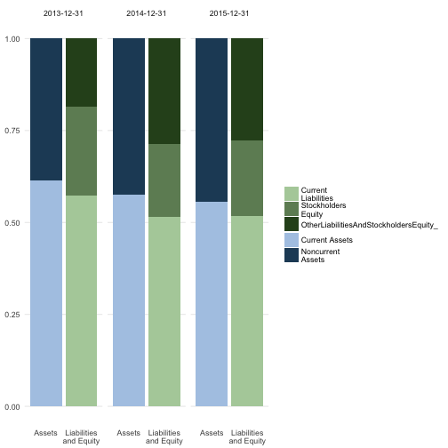


Analyzing Apple
========================================================


```r
#AAPL forms
aapl_url2015<-'http://localhost:8000/aapl/2015/aapl-20140927.xml'
aapl_url2016<- 'http://localhost:8000/aapl/2016/aapl-20150926.xml'
old_o <- options(stringsAsFactors = FALSE)
aapl_2015 <- xbrlDoAll(aapl_url2015)
aapl_2016 <- xbrlDoAll(aapl_url2016)
options(old_o)
aapl2015 <- xbrl_get_statements(aapl_2015)
aapl2016 <- xbrl_get_statements(aapl_2016)
```

Apple 10K in 2015
========================================================

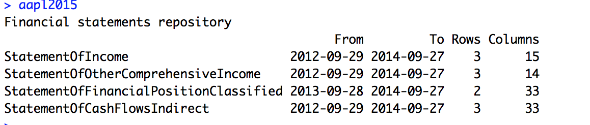

## Apple 10K in 2016

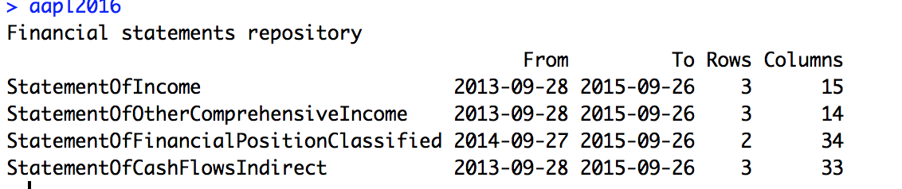

Merge the result!
========================================================


```r
aapl <- merge(aapl2015,aapl2016)
aaplBalanceSheet <- merge(aapl2015$StatementOfFinancialPositionClassified,aapl2016$StatementOfFinancialPositionClassified)
aaplCashFlow <- merge(aapl2015$StatementOfCashFlowsIndirect,aapl2016$StatementOfCashFlowsIndirect)
```
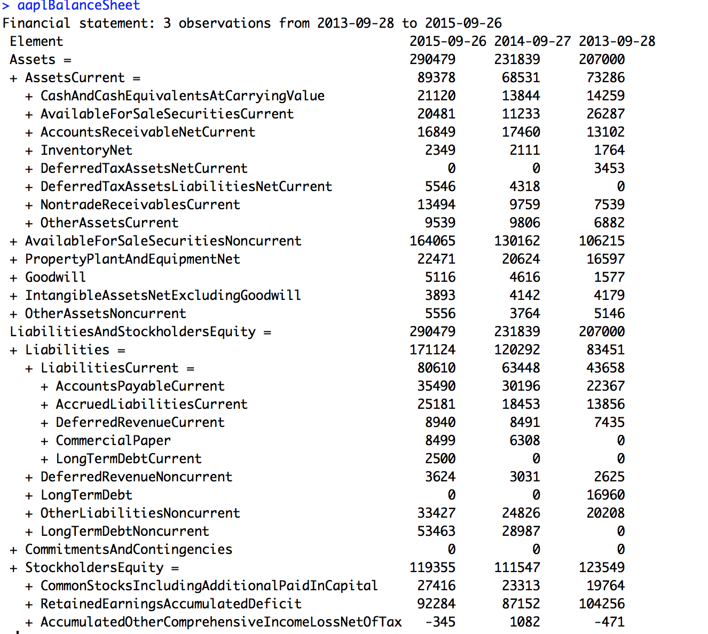

Financial ratios!
========================================================
It's the ratio of current assests / current liabilities.  


```r
aaplBalanceSheet %>% transmute(
date = endDate,
CurrentRatio = AssetsCurrent / LiabilitiesCurrent
)
```

```
        date CurrentRatio
1 2013-09-28     1.678639
2 2014-09-27     1.080113
3 2015-09-26     1.108771
```

`Inference : Apple consistently had a ratio of 1.0 or greater which indicates that Apple possesed more assets than liablities, which is a good sign for company's growth.`

Visualize Profit and Loss!
========================================================
Consolidated Statement of Income.

This dataset highlights the gross profit and operating expenses at Apple.


```r
aaplIncome <- expose( aapl$StatementOfIncome,
`Op Exp` = 'OperatingIncomeLoss',
`Non Ops Exp` = 'NonoperatingIncomeExpense'
)

print(aaplIncome, html = TRUE, big.mark = ",", dateFormat = "%Y")
```

<table class='gmisc_table' style='border-collapse: collapse; margin-top: 1em; margin-bottom: 1em;' >
<thead>
<tr>
<th style='border-bottom: 1px solid grey; border-top: 2px solid grey;'> </th>
<th style='border-bottom: 1px solid grey; border-top: 2px solid grey; text-align: center;'>2015</th>
<th style='border-bottom: 1px solid grey; border-top: 2px solid grey; text-align: center;'>2014</th>
<th style='border-bottom: 1px solid grey; border-top: 2px solid grey; text-align: center;'>2013</th>
<th style='border-bottom: 1px solid grey; border-top: 2px solid grey; text-align: center;'>2012</th>
</tr>
</thead>
<tbody>
<tr>
<td style='text-align: left;'><strong>Net Income (Loss) Attributable to Parent</strong></td>
<td style='text-align: right;'><strong> 53,394</strong></td>
<td style='text-align: right;'><strong> 39,510</strong></td>
<td style='text-align: right;'><strong> 37,037</strong></td>
<td style='text-align: right;'><strong> 41,733</strong></td>
</tr>
<tr>
<td style='text-align: left;'>&nbsp;&nbsp;&nbsp;Op Exp</td>
<td style='text-align: right;'> 71,230</td>
<td style='text-align: right;'> 52,503</td>
<td style='text-align: right;'> 48,999</td>
<td style='text-align: right;'> 55,241</td>
</tr>
<tr>
<td style='text-align: left;'>&nbsp;&nbsp;&nbsp;Non Ops Exp</td>
<td style='text-align: right;'>  1,285</td>
<td style='text-align: right;'>    980</td>
<td style='text-align: right;'>  1,156</td>
<td style='text-align: right;'>    522</td>
</tr>
<tr>
<td style='border-bottom: 2px solid grey; text-align: left;'>&nbsp;&nbsp;&nbsp;OtherNetIncomeLoss_</td>
<td style='border-bottom: 2px solid grey; text-align: right;'>-19,121</td>
<td style='border-bottom: 2px solid grey; text-align: right;'>-13,973</td>
<td style='border-bottom: 2px solid grey; text-align: right;'>-13,118</td>
<td style='border-bottom: 2px solid grey; text-align: right;'>-14,030</td>
</tr>
</tbody>
</table>

`Inference: Apple as a company is increasing the net income while also increasing gross expenditure`

Visualizing Cash Flow!
========================================================
This dataset highlights how the money is used in Amazon.


```r
aaplCashflow_simple <- expose( aaplCashFlow,
`Ops Activities` = 'NetCashProvidedByUsedInOperatingActivitiesContinuingOperations',
`Investing` = 'NetCashProvidedByUsedInInvestingActivitiesContinuingOperations',
`Financing` = 'NetCashProvidedByUsedInFinancingActivitiesContinuingOperations'
)
print(aaplCashflow_simple, html = TRUE, big.mark = ",", dateFormat = "%Y")
```

<table class='gmisc_table' style='border-collapse: collapse; margin-top: 1em; margin-bottom: 1em;' >
<thead>
<tr>
<th style='border-bottom: 1px solid grey; border-top: 2px solid grey;'> </th>
<th style='border-bottom: 1px solid grey; border-top: 2px solid grey; text-align: center;'>2015</th>
<th style='border-bottom: 1px solid grey; border-top: 2px solid grey; text-align: center;'>2014</th>
<th style='border-bottom: 1px solid grey; border-top: 2px solid grey; text-align: center;'>2013</th>
<th style='border-bottom: 1px solid grey; border-top: 2px solid grey; text-align: center;'>2012</th>
</tr>
</thead>
<tbody>
<tr>
<td style='text-align: left;'><strong>Cash and Cash Equivalents, Period Increase (Decrease)</strong></td>
<td style='text-align: right;'><strong>  7,276</strong></td>
<td style='text-align: right;'><strong>   -415</strong></td>
<td style='text-align: right;'><strong>  3,513</strong></td>
<td style='text-align: right;'><strong>    931</strong></td>
</tr>
<tr>
<td style='text-align: left;'>&nbsp;&nbsp;&nbsp;Ops Activities</td>
<td style='text-align: right;'>-25,522</td>
<td style='text-align: right;'>-19,307</td>
<td style='text-align: right;'>-20,408</td>
<td style='text-align: right;'>-32,610</td>
</tr>
<tr>
<td style='text-align: left;'>&nbsp;&nbsp;&nbsp;Investing</td>
<td style='text-align: right;'>-56,274</td>
<td style='text-align: right;'>-22,579</td>
<td style='text-align: right;'>-33,774</td>
<td style='text-align: right;'>-48,227</td>
</tr>
<tr>
<td style='border-bottom: 2px solid grey; text-align: left;'>&nbsp;&nbsp;&nbsp;Financing</td>
<td style='border-bottom: 2px solid grey; text-align: right;'>-17,716</td>
<td style='border-bottom: 2px solid grey; text-align: right;'>-37,549</td>
<td style='border-bottom: 2px solid grey; text-align: right;'>-16,379</td>
<td style='border-bottom: 2px solid grey; text-align: right;'> -1,698</td>
</tr>
</tbody>
</table>

`Inference: Apple has reduced the amount spent in Ops which is a good thing, indicating that a lot of automation is happening inside the company to reduce this cost. Apple has varied it's amount of investing in other avenues. Apple also earns a tiny amount from a lot of it's patents as shown in the last column.`


Visualizing Balance Sheet!
========================================================

This dataset highlights core components of Balance sheet of Apple

```r
aaplBalanceSheet_simple<- expose( aaplBalanceSheet,
# Assets
`Current Assets` = "AssetsCurrent",
`Noncurrent Assets` = other("Assets"),
# Liabilites and equity
`Current Liabilities` = "LiabilitiesCurrent",
`Noncurrent Liabilities` = other(c("Liabilities", "CommitmentsAndContingencies")),
`Stockholders Equity` = "StockholdersEquity"
)

print(aaplBalanceSheet_simple, html = TRUE, big.mark = ",", dateFormat = "%Y")
```

<table class='gmisc_table' style='border-collapse: collapse; margin-top: 1em; margin-bottom: 1em;' >
<thead>
<tr>
<th style='border-bottom: 1px solid grey; border-top: 2px solid grey;'> </th>
<th style='border-bottom: 1px solid grey; border-top: 2px solid grey; text-align: center;'>2015</th>
<th style='border-bottom: 1px solid grey; border-top: 2px solid grey; text-align: center;'>2014</th>
<th style='border-bottom: 1px solid grey; border-top: 2px solid grey; text-align: center;'>2013</th>
</tr>
</thead>
<tbody>
<tr>
<td style='text-align: left;'><strong>Assets</strong></td>
<td style='text-align: right;'><strong>290,479</strong></td>
<td style='text-align: right;'><strong>231,839</strong></td>
<td style='text-align: right;'><strong>207,000</strong></td>
</tr>
<tr>
<td style='text-align: left;'>&nbsp;&nbsp;&nbsp;Current Assets</td>
<td style='text-align: right;'> 89,378</td>
<td style='text-align: right;'> 68,531</td>
<td style='text-align: right;'> 73,286</td>
</tr>
<tr>
<td style='text-align: left;'>&nbsp;&nbsp;&nbsp;Noncurrent Assets</td>
<td style='text-align: right;'>201,101</td>
<td style='text-align: right;'>163,308</td>
<td style='text-align: right;'>133,714</td>
</tr>
<tr>
<td style='text-align: left;'><strong>Liabilities and Equity</strong></td>
<td style='text-align: right;'><strong>290,479</strong></td>
<td style='text-align: right;'><strong>231,839</strong></td>
<td style='text-align: right;'><strong>207,000</strong></td>
</tr>
<tr>
<td style='text-align: left;'>&nbsp;&nbsp;&nbsp;Current Liabilities</td>
<td style='text-align: right;'> 80,610</td>
<td style='text-align: right;'> 63,448</td>
<td style='text-align: right;'> 43,658</td>
</tr>
<tr>
<td style='text-align: left;'>&nbsp;&nbsp;&nbsp;Noncurrent Liabilities</td>
<td style='text-align: right;'> 90,514</td>
<td style='text-align: right;'> 56,844</td>
<td style='text-align: right;'> 39,793</td>
</tr>
<tr>
<td style='border-bottom: 2px solid grey; text-align: left;'>&nbsp;&nbsp;&nbsp;Stockholders Equity</td>
<td style='border-bottom: 2px solid grey; text-align: right;'>119,355</td>
<td style='border-bottom: 2px solid grey; text-align: right;'>111,547</td>
<td style='border-bottom: 2px solid grey; text-align: right;'>123,549</td>
</tr>
</tbody>
</table>

Visualizing in detail
========================================================


```r
plot_double_stacked_bar(aaplBalanceSheet_simple)
```

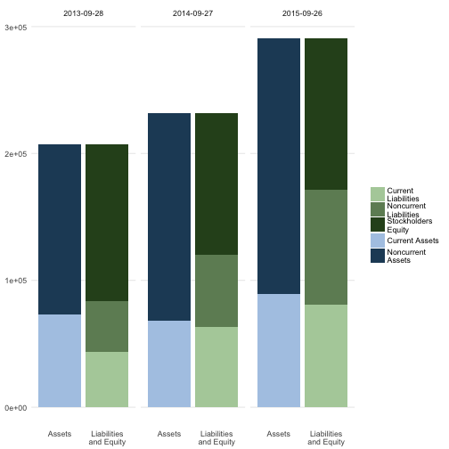

```r
plot_double_stacked_bar(proportional(aaplBalanceSheet_simple))
```

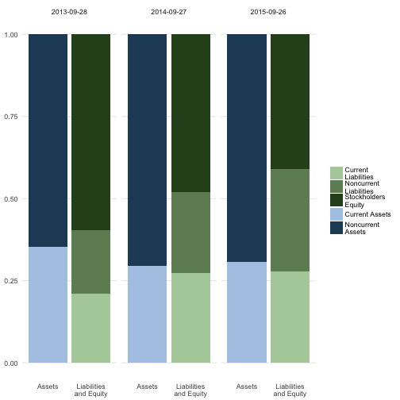

Analyzing Pepsi
========================================================


```r
#Pepsi forms
pep_url2015 <-'http://localhost:8000/pep/2015/pep-20141227.xml'
pep_url2016 <-'http://localhost:8000/pep/2016/pep-20151226.xml'
old_o <- options(stringsAsFactors = FALSE)
pep_2015 <- xbrlDoAll(pep_url2015)
pep_2016 <- xbrlDoAll(pep_url2016)
options(old_o)
pep2015 <- xbrl_get_statements(pep_2015)
pep2016 <- xbrl_get_statements(pep_2016)
```

Pepsi 10K in 2015
========================================================

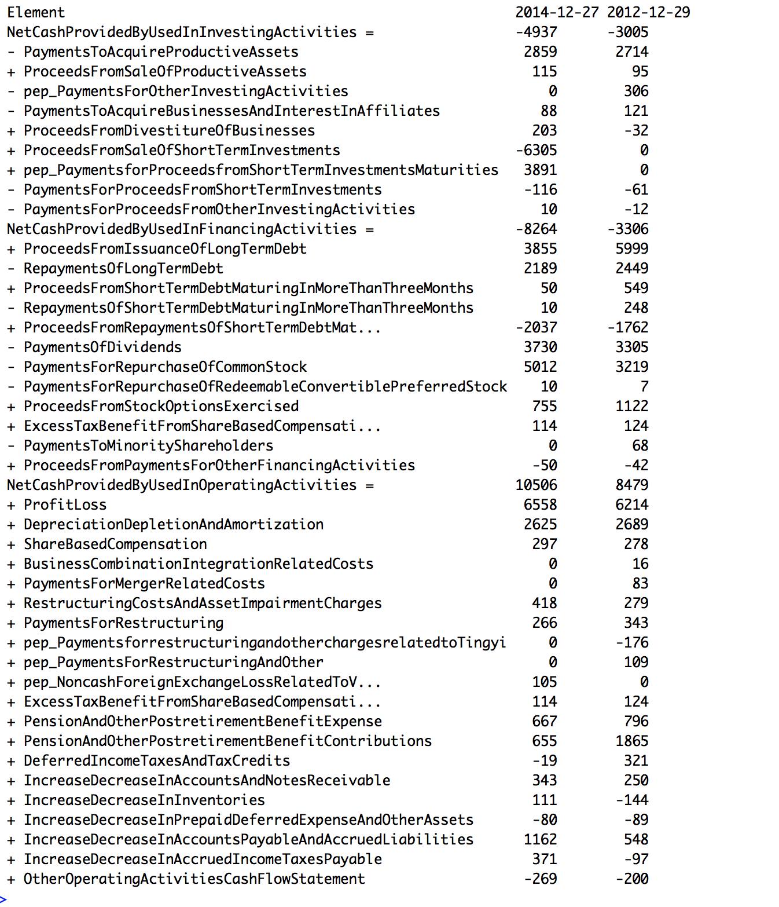

## Pepsi 10K in 2016

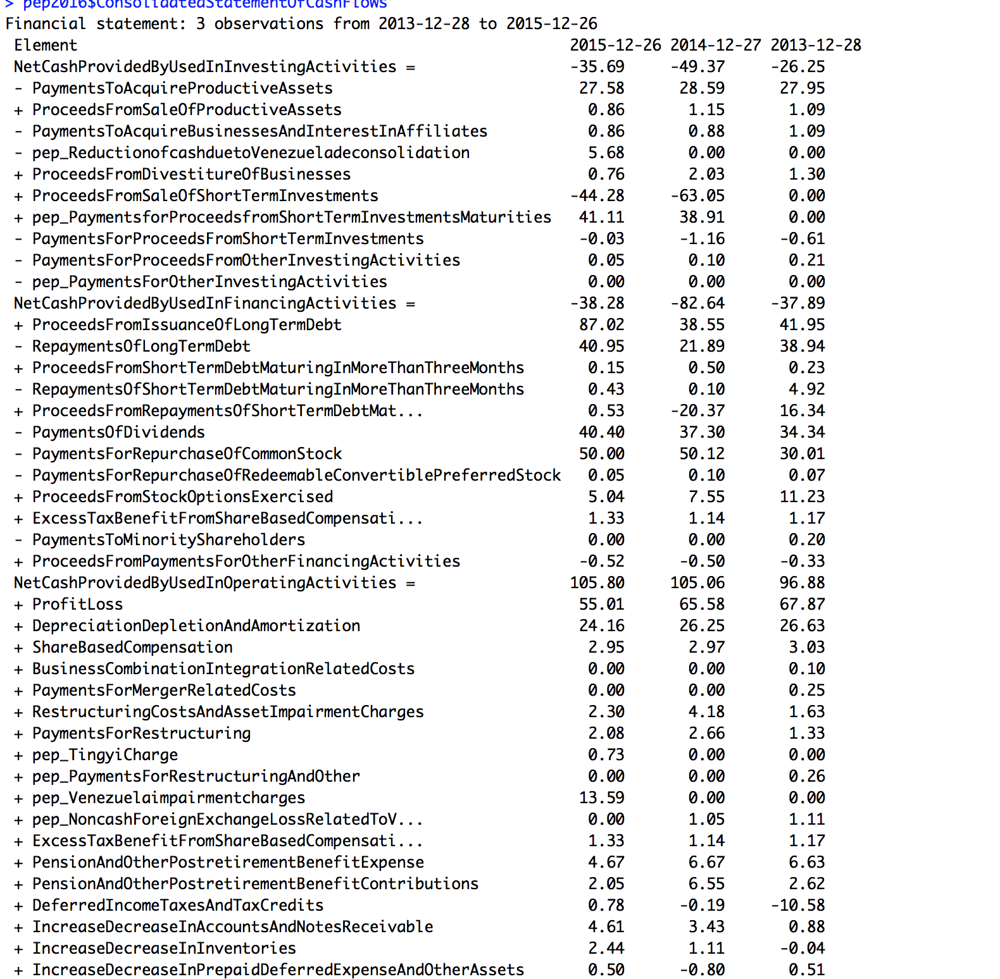

Merge the result!
========================================================


```r
pepCashFlow <- merge(pep2015$ConsolidatedStatementOfCashFlows,pep2016$ConsolidatedStatementOfCashFlows)
pepIncomeStatement <- merge(pep2015$ConsolidatedStatementOfIncome,pep2016$ConsolidatedStatementOfIncome)
```
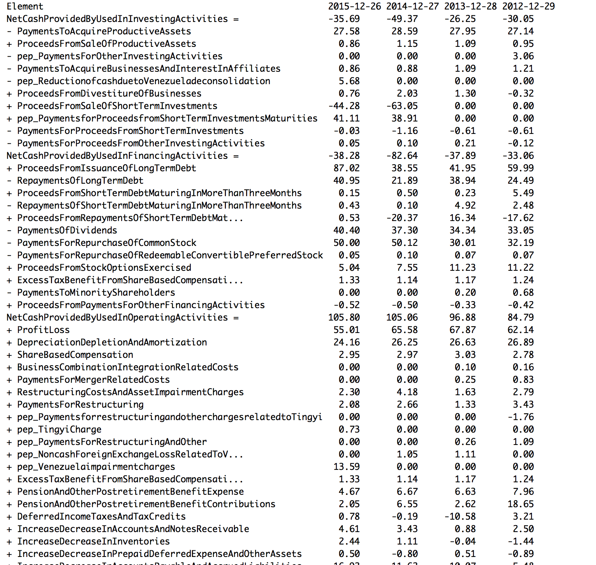


Visualize Profit and Loss!
========================================================
Consolidated Statement of Income.

This dataset highlights the gross income loss and operating expenses at Pepsi


```r
pepIncomeStatement_simple <- expose( pepIncomeStatement,
`Op Exp` = 'OperatingIncomeLoss',
`Non Ops Exp` = 'pep_InterestIncomeAndOther'
)

print(pepIncomeStatement_simple, html = TRUE, big.mark = ",", dateFormat = "%Y")
```

<table class='gmisc_table' style='border-collapse: collapse; margin-top: 1em; margin-bottom: 1em;' >
<thead>
<tr>
<th style='border-bottom: 1px solid grey; border-top: 2px solid grey;'> </th>
<th style='border-bottom: 1px solid grey; border-top: 2px solid grey; text-align: center;'>2015</th>
<th style='border-bottom: 1px solid grey; border-top: 2px solid grey; text-align: center;'>2014</th>
<th style='border-bottom: 1px solid grey; border-top: 2px solid grey; text-align: center;'>2013</th>
<th style='border-bottom: 1px solid grey; border-top: 2px solid grey; text-align: center;'>2012</th>
</tr>
</thead>
<tbody>
<tr>
<td style='text-align: left;'><strong>Income (Loss) from Continuing Operations before Income Taxes, Extraordinary Items, Noncontrolling Interest</strong></td>
<td style='text-align: right;'><strong> 7.442</strong></td>
<td style='text-align: right;'><strong> 8.757</strong></td>
<td style='text-align: right;'><strong> 8.891</strong></td>
<td style='text-align: right;'><strong> 8.304</strong></td>
</tr>
<tr>
<td style='text-align: left;'>&nbsp;&nbsp;&nbsp;Op Exp</td>
<td style='text-align: right;'> 8.353</td>
<td style='text-align: right;'> 9.581</td>
<td style='text-align: right;'> 9.705</td>
<td style='text-align: right;'> 9.112</td>
</tr>
<tr>
<td style='text-align: left;'>&nbsp;&nbsp;&nbsp;Non Ops Exp</td>
<td style='text-align: right;'> 0.059</td>
<td style='text-align: right;'> 0.085</td>
<td style='text-align: right;'> 0.097</td>
<td style='text-align: right;'> 0.091</td>
</tr>
<tr>
<td style='text-align: left;'>&nbsp;&nbsp;&nbsp;OtherIncomeLossFromContinuingOperationsBeforeIncomeTaxesExtraordinaryItemsNoncontrollingInterest_</td>
<td style='text-align: right;'>-0.970</td>
<td style='text-align: right;'>-0.909</td>
<td style='text-align: right;'>-0.911</td>
<td style='text-align: right;'>-0.899</td>
</tr>
<tr>
<td style='text-align: left;'><strong>Net Income (Loss) Attributable to Parent</strong></td>
<td style='text-align: right;'><strong> 5.452</strong></td>
<td style='text-align: right;'><strong> 6.513</strong></td>
<td style='text-align: right;'><strong> 6.740</strong></td>
<td style='text-align: right;'><strong> 6.178</strong></td>
</tr>
<tr>
<td style='border-bottom: 2px solid grey; text-align: left;'>&nbsp;&nbsp;&nbsp;OtherNetIncomeLoss_</td>
<td style='border-bottom: 2px solid grey; text-align: right;'> 5.452</td>
<td style='border-bottom: 2px solid grey; text-align: right;'> 6.513</td>
<td style='border-bottom: 2px solid grey; text-align: right;'> 6.740</td>
<td style='border-bottom: 2px solid grey; text-align: right;'> 6.178</td>
</tr>
</tbody>
</table>

`Inference: Pepsi as a company is making losses`

Maintain integrity always, else face losses!
========================================================
`There's an interesting data point which is observed in the statements of Pepsi, which is  $pep_Venezuelaimpairmentcharges`. 

Pepsi had to suffered huge losses due to this allegation. 

```r
pepIncomeStatement$pep_Venezuelaimpairmentcharges
```

```
[1] 0.000e+00 0.000e+00 0.000e+00 1.359e+09
```
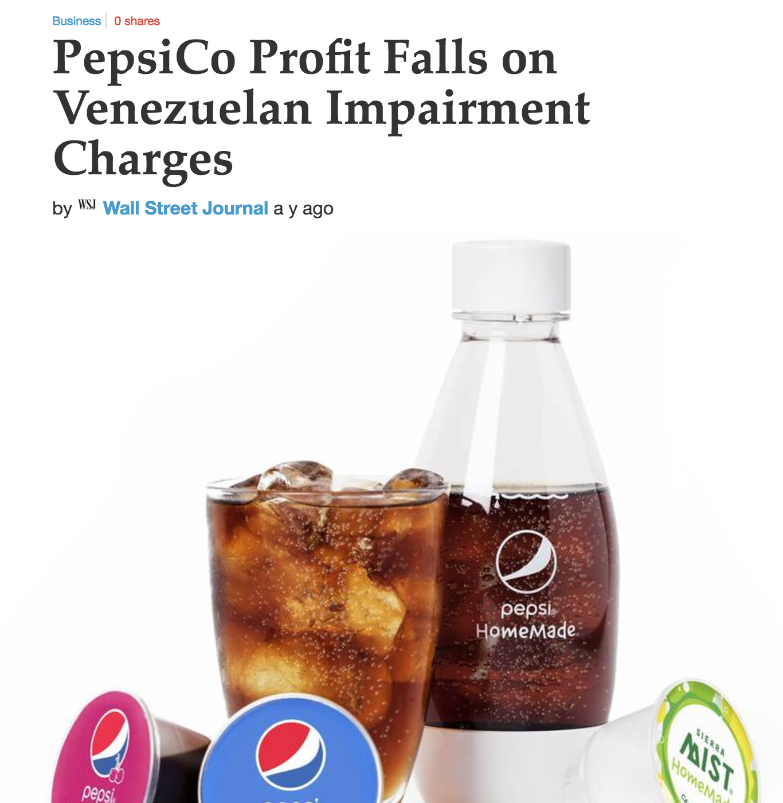

Visualizing Cash Flow!
========================================================
This dataset highlights how the money is used in Pepsi.


```r
pepCashflow_simple <- expose( pepCashFlow)
print(pepCashflow_simple, html = TRUE, big.mark = ",", dateFormat = "%Y")
```

<table class='gmisc_table' style='border-collapse: collapse; margin-top: 1em; margin-bottom: 1em;' >
<thead>
<tr>
<th style='border-bottom: 1px solid grey; border-top: 2px solid grey;'> </th>
<th style='border-bottom: 1px solid grey; border-top: 2px solid grey; text-align: center;'>2015</th>
<th style='border-bottom: 1px solid grey; border-top: 2px solid grey; text-align: center;'>2014</th>
<th style='border-bottom: 1px solid grey; border-top: 2px solid grey; text-align: center;'>2013</th>
<th style='border-bottom: 1px solid grey; border-top: 2px solid grey; text-align: center;'>2012</th>
</tr>
</thead>
<tbody>
<tr>
<td style='text-align: left;'>Net Cash Provided by (Used in) Investing Activities</td>
<td style='text-align: right;'>-35.69</td>
<td style='text-align: right;'>-49.37</td>
<td style='text-align: right;'>-26.25</td>
<td style='text-align: right;'>-30.05</td>
</tr>
<tr>
<td style='text-align: left;'>Net Cash Provided by (Used in) Financing Activities</td>
<td style='text-align: right;'>-38.28</td>
<td style='text-align: right;'>-82.64</td>
<td style='text-align: right;'>-37.89</td>
<td style='text-align: right;'>-33.06</td>
</tr>
<tr>
<td style='border-bottom: 2px solid grey; text-align: left;'>Net Cash Provided by (Used in) Operating Activities</td>
<td style='border-bottom: 2px solid grey; text-align: right;'>105.80</td>
<td style='border-bottom: 2px solid grey; text-align: right;'>105.06</td>
<td style='border-bottom: 2px solid grey; text-align: right;'> 96.88</td>
<td style='border-bottom: 2px solid grey; text-align: right;'> 84.79</td>
</tr>
</tbody>
</table>

`Inference: Pepsi has not been able to minimise it's expenditure on Ops Activities. Perhaps if Pepsi focus on reducing this, it can generate more profits.`


Visualizing in detail
========================================================


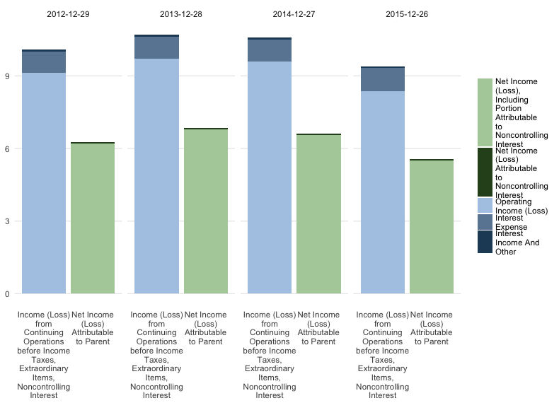
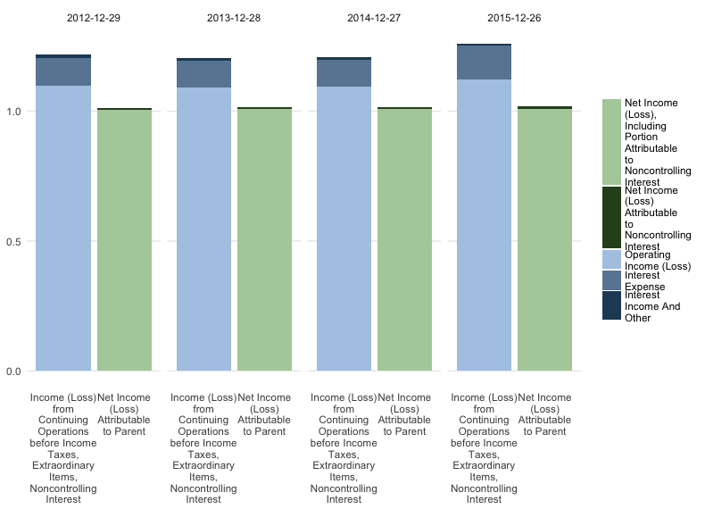


