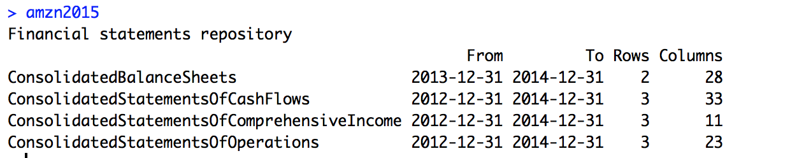
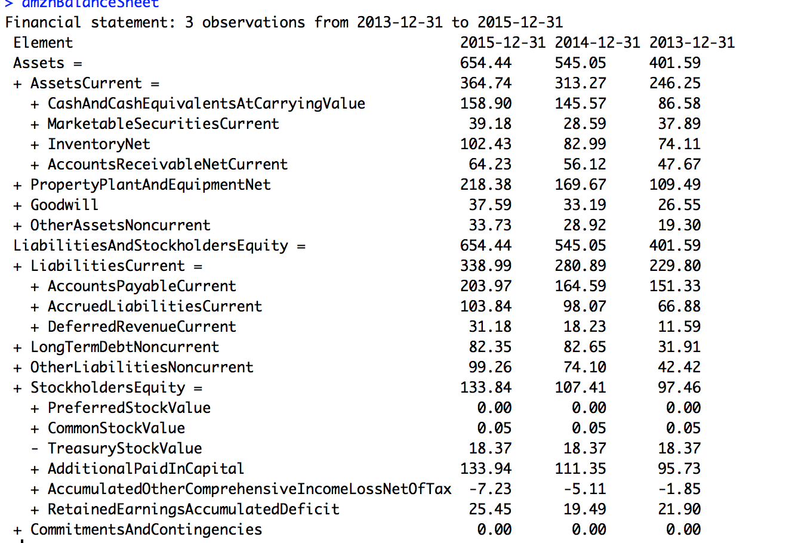
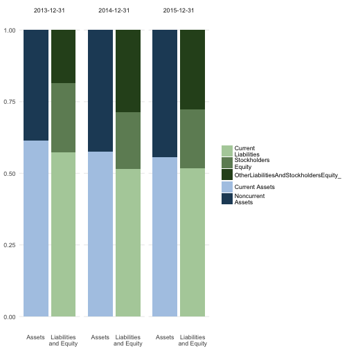

Company Balance Sheet Analysis
========================================================
author: Karan Sharma
date: 15th November 2016
autosize: true

List of Companies
========================================================

10k forms scraped from: <https://www.sec.gov/>.

- $AMZN (Amazon)
- $AAPL (Apple)
- $PEP (Pepsi)
- $FB (Facebook)
- $GM (General Motors)

Setting up things
========================================================


```r
# To parse XML documents
library(XBRL)
old_o <- options(stringsAsFactors = FALSE)
# To visualize results
library(plotly)
library(ggplot2)
# To analyze balance sheets
library(finstr)
# Data munging
library(dplyr)
# HTML Tables
library(htmlTable)
setwd("~/Work/BigDataAssignments/secgovanalyze")
```

Analyzing Amazon
========================================================


```r
#AMZN forms
amzn_url2015<-'http://localhost:8000/amzn/2015/amzn-20141231.xml'
amzn_url2016<- 'http://localhost:8000/amzn/2016/amzn-20151231.xml'
amzn_2015 <- xbrlDoAll(amzn_url2015)
amzn_2016 <- xbrlDoAll(amzn_url2016)
options(old_o)
amzn2015 <- xbrl_get_statements(amzn_2015)
amzn2016 <- xbrl_get_statements(amzn_2016)
```

Amazon 10K in 2015
========================================================



## Amazon 10K in 2016


Merge the result!
========================================================


```r
amzn <- merge(amzn2015,amzn2016)
amznSOP <- merge(amzn2015$ConsolidatedStatementsOfOperations,amzn2016$ConsolidatedStatementsOfOperations)
amznBalanceSheet<- merge(amzn2015$ConsolidatedBalanceSheets,amzn2016$ConsolidatedBalanceSheets)
amznCashflow <- merge(amzn2015$ConsolidatedStatementsOfCashFlows,amzn2016$ConsolidatedStatementsOfCashFlows)
```


Financial ratios!
========================================================
It's the ratio of current assests / current liabilities.  


```r
amznBalanceSheet %>% transmute(
  date = endDate, 
  CurrentRatio = AssetsCurrent / LiabilitiesCurrent
)
```

```
        date CurrentRatio
1 2013-12-31     1.071584
2 2014-12-31     1.115276
3 2015-12-31     1.075961
```

`Inference : Amazon consistently had a ratio of 1.0 or greater which indicates that Amazon possesed more assets than liablities, which is a good sign for company's growth.`

Visualize Revenue and Expenditure!
========================================================
Consolidated Statement of Operations.
This dataset highlights the Revenue earned by Amazon v/s amount spent in activities like 
`marketing`, `admnistration expense`, `cost of goods and services sold`, `amazon fulfillment expense` and other `ops costs`.


```r
amznSOP_simple <- expose( amznSOP,
`Revenue` = 'SalesRevenueNet',
`Expenditure` = 'CostsAndExpenses'
)

print(amznSOP_simple, html = TRUE, big.mark = ",", dateFormat = "%Y")
```

<table class='gmisc_table' style='border-collapse: collapse; margin-top: 1em; margin-bottom: 1em;' >
<thead>
<tr>
<th style='border-bottom: 1px solid grey; border-top: 2px solid grey;'> </th>
<th style='border-bottom: 1px solid grey; border-top: 2px solid grey; text-align: center;'>2015</th>
<th style='border-bottom: 1px solid grey; border-top: 2px solid grey; text-align: center;'>2014</th>
<th style='border-bottom: 1px solid grey; border-top: 2px solid grey; text-align: center;'>2013</th>
<th style='border-bottom: 1px solid grey; border-top: 2px solid grey; text-align: center;'>2012</th>
</tr>
</thead>
<tbody>
<tr>
<td style='text-align: left;'><strong>Net Income (Loss) Attributable to Parent</strong></td>
<td style='text-align: right;'><strong>     596</strong></td>
<td style='text-align: right;'><strong>   -241</strong></td>
<td style='text-align: right;'><strong>    274</strong></td>
<td style='text-align: right;'><strong>    -39</strong></td>
</tr>
<tr>
<td style='text-align: left;'>&nbsp;&nbsp;&nbsp;Revenue</td>
<td style='text-align: right;'> 107,006</td>
<td style='text-align: right;'> 88,988</td>
<td style='text-align: right;'> 74,452</td>
<td style='text-align: right;'> 61,093</td>
</tr>
<tr>
<td style='text-align: left;'>&nbsp;&nbsp;&nbsp;Expenditure</td>
<td style='text-align: right;'>-104,773</td>
<td style='text-align: right;'>-88,810</td>
<td style='text-align: right;'>-73,707</td>
<td style='text-align: right;'>-60,417</td>
</tr>
<tr>
<td style='border-bottom: 2px solid grey; text-align: left;'>&nbsp;&nbsp;&nbsp;OtherNetIncomeLoss_</td>
<td style='border-bottom: 2px solid grey; text-align: right;'>  -1,637</td>
<td style='border-bottom: 2px solid grey; text-align: right;'>   -419</td>
<td style='border-bottom: 2px solid grey; text-align: right;'>   -471</td>
<td style='border-bottom: 2px solid grey; text-align: right;'>   -715</td>
</tr>
</tbody>
</table>

`Inference: Amazon as a company is increasing it's revenue every year, but this is only possible with greater expenditure. `
`Bottomline: More the expenditure more is the revenue`

Visualizing Cash Flow!
========================================================
This dataset highlights how the money is used in Amazon.


```r
amznCashflow_simple <- expose( amznCashflow,
`Ops Activities` = 'NetCashProvidedByUsedInOperatingActivities',
`Investing` = 'NetCashProvidedByUsedInInvestingActivities',
`Financing` = 'NetCashProvidedByUsedInFinancingActivities'
)
print(amznCashflow_simple, html = TRUE, big.mark = ",", dateFormat = "%Y")
```

<table class='gmisc_table' style='border-collapse: collapse; margin-top: 1em; margin-bottom: 1em;' >
<thead>
<tr>
<th style='border-bottom: 1px solid grey; border-top: 2px solid grey;'> </th>
<th style='border-bottom: 1px solid grey; border-top: 2px solid grey; text-align: center;'>2015</th>
<th style='border-bottom: 1px solid grey; border-top: 2px solid grey; text-align: center;'>2014</th>
<th style='border-bottom: 1px solid grey; border-top: 2px solid grey; text-align: center;'>2013</th>
<th style='border-bottom: 1px solid grey; border-top: 2px solid grey; text-align: center;'>2012</th>
</tr>
</thead>
<tbody>
<tr>
<td style='text-align: left;'><strong>Cash and Cash Equivalents, Period Increase (Decrease)</strong></td>
<td style='text-align: right;'><strong> 1,333</strong></td>
<td style='text-align: right;'><strong> 5,899</strong></td>
<td style='text-align: right;'><strong>   574</strong></td>
<td style='text-align: right;'><strong> 2,815</strong></td>
</tr>
<tr>
<td style='text-align: left;'>&nbsp;&nbsp;&nbsp;Ops Activities</td>
<td style='text-align: right;'>10,728</td>
<td style='text-align: right;'> 7,324</td>
<td style='text-align: right;'> 4,927</td>
<td style='text-align: right;'> 4,258</td>
</tr>
<tr>
<td style='text-align: left;'>&nbsp;&nbsp;&nbsp;Investing</td>
<td style='text-align: right;'>-6,450</td>
<td style='text-align: right;'>-7,607</td>
<td style='text-align: right;'>-7,102</td>
<td style='text-align: right;'>-3,595</td>
</tr>
<tr>
<td style='text-align: left;'>&nbsp;&nbsp;&nbsp;Financing</td>
<td style='text-align: right;'>-3,763</td>
<td style='text-align: right;'> 4,432</td>
<td style='text-align: right;'>  -539</td>
<td style='text-align: right;'> 2,259</td>
</tr>
<tr>
<td style='border-bottom: 2px solid grey; text-align: left;'>&nbsp;&nbsp;&nbsp;OtherCashAndCashEquivalentsPeriodIncreaseDecrease_</td>
<td style='border-bottom: 2px solid grey; text-align: right;'>  -374</td>
<td style='border-bottom: 2px solid grey; text-align: right;'>  -310</td>
<td style='border-bottom: 2px solid grey; text-align: right;'>   -86</td>
<td style='border-bottom: 2px solid grey; text-align: right;'>   -29</td>
</tr>
</tbody>
</table>

`Inference: Amazon spends most of the money in Day to day operational activities, but invests some money in acquiring property plant, equipment, business interests, marketable services`

Visualizing Balance Sheet!
========================================================

This dataset highlights core components of Balance sheet of Amazon

```r
amznBalanceSheet_simple<- expose( amznBalanceSheet,
# Assets
`Current Assets` = "AssetsCurrent",
`Noncurrent Assets` = other("Assets"),
# Liabilites and equity
`Current Liabilities` = "LiabilitiesCurrent",
`Stockholders Equity` = "StockholdersEquity"
)
print(amznBalanceSheet_simple, html = TRUE, big.mark = ",", dateFormat = "%Y")
```

<table class='gmisc_table' style='border-collapse: collapse; margin-top: 1em; margin-bottom: 1em;' >
<thead>
<tr>
<th style='border-bottom: 1px solid grey; border-top: 2px solid grey;'> </th>
<th style='border-bottom: 1px solid grey; border-top: 2px solid grey; text-align: center;'>2015</th>
<th style='border-bottom: 1px solid grey; border-top: 2px solid grey; text-align: center;'>2014</th>
<th style='border-bottom: 1px solid grey; border-top: 2px solid grey; text-align: center;'>2013</th>
</tr>
</thead>
<tbody>
<tr>
<td style='text-align: left;'><strong>Assets</strong></td>
<td style='text-align: right;'><strong>654.44</strong></td>
<td style='text-align: right;'><strong>545.05</strong></td>
<td style='text-align: right;'><strong>401.59</strong></td>
</tr>
<tr>
<td style='text-align: left;'>&nbsp;&nbsp;&nbsp;Current Assets</td>
<td style='text-align: right;'>364.74</td>
<td style='text-align: right;'>313.27</td>
<td style='text-align: right;'>246.25</td>
</tr>
<tr>
<td style='text-align: left;'>&nbsp;&nbsp;&nbsp;Noncurrent Assets</td>
<td style='text-align: right;'>289.70</td>
<td style='text-align: right;'>231.78</td>
<td style='text-align: right;'>155.34</td>
</tr>
<tr>
<td style='text-align: left;'><strong>Liabilities and Equity</strong></td>
<td style='text-align: right;'><strong>654.44</strong></td>
<td style='text-align: right;'><strong>545.05</strong></td>
<td style='text-align: right;'><strong>401.59</strong></td>
</tr>
<tr>
<td style='text-align: left;'>&nbsp;&nbsp;&nbsp;Current Liabilities</td>
<td style='text-align: right;'>338.99</td>
<td style='text-align: right;'>280.89</td>
<td style='text-align: right;'>229.80</td>
</tr>
<tr>
<td style='text-align: left;'>&nbsp;&nbsp;&nbsp;Stockholders Equity</td>
<td style='text-align: right;'>133.84</td>
<td style='text-align: right;'>107.41</td>
<td style='text-align: right;'> 97.46</td>
</tr>
<tr>
<td style='border-bottom: 2px solid grey; text-align: left;'>&nbsp;&nbsp;&nbsp;OtherLiabilitiesAndStockholdersEquity_</td>
<td style='border-bottom: 2px solid grey; text-align: right;'>181.61</td>
<td style='border-bottom: 2px solid grey; text-align: right;'>156.75</td>
<td style='border-bottom: 2px solid grey; text-align: right;'> 74.33</td>
</tr>
</tbody>
</table>

Visualizing in detail
========================================================


```r
plot_double_stacked_bar(amznBalanceSheet_simple)
```


```r
plot_double_stacked_bar(proportional(amznBalanceSheet_simple))
```




$AAPL
========================================================
