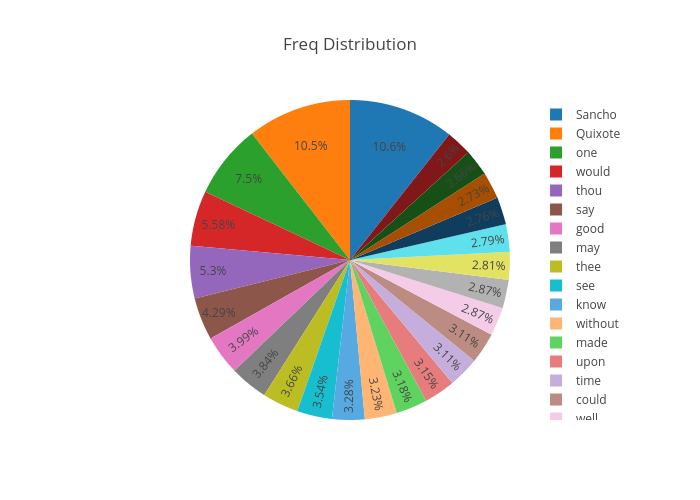
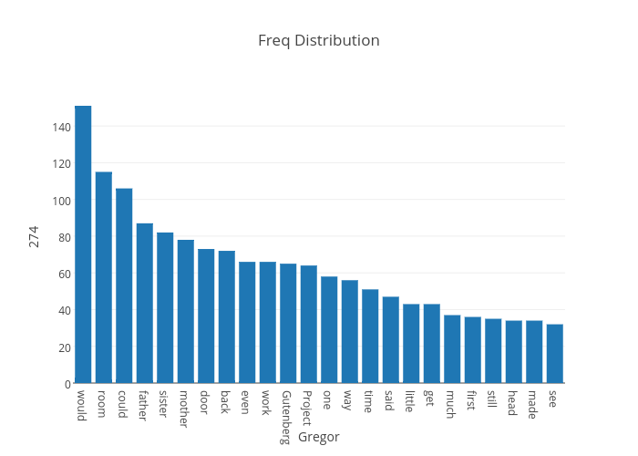
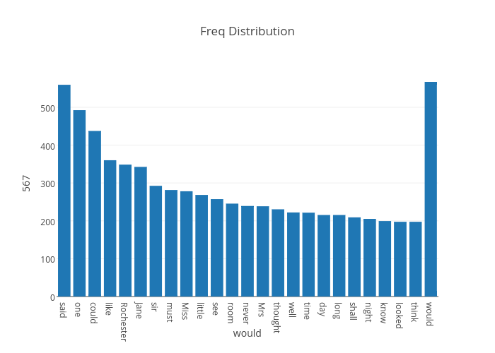
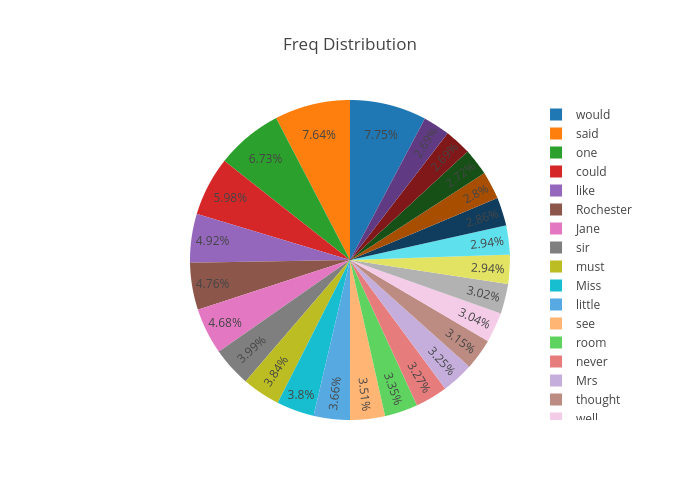
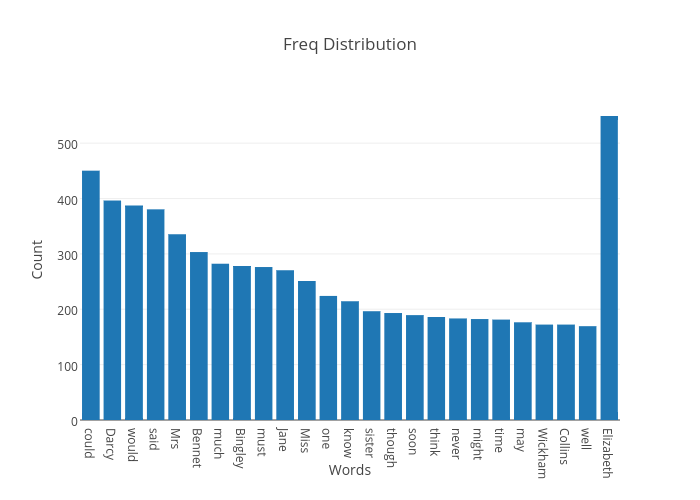
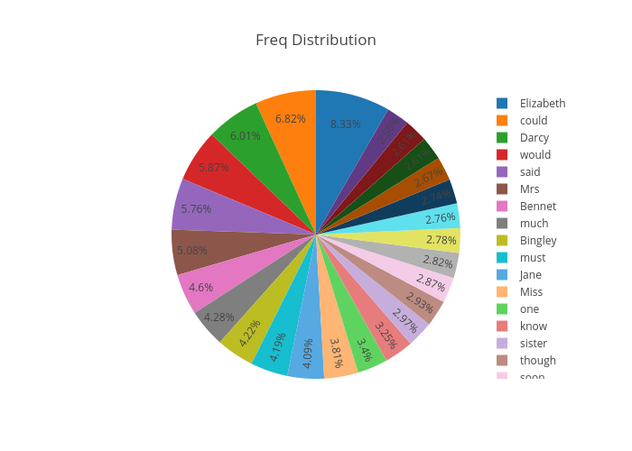
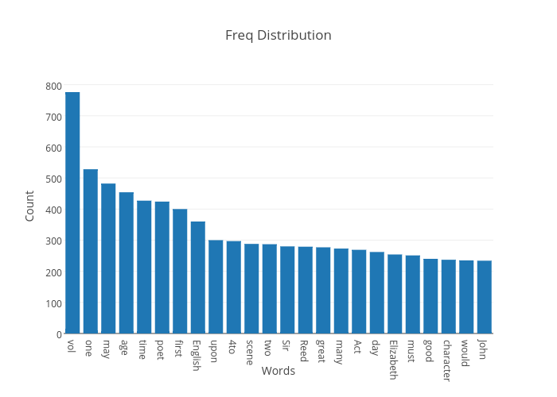

# Installation Instructions

### Java

`brew cask install java`

### Hadoop

`brew install hadoop`

### SSH Localhost

```ssh localhost```

### Text Data

Download from free `Project Gutenberg`
- Franz Kafka : 139054 characters (141 KB)
- Don Quixote : 2307785 characters (2.9 MB)
- Shakespeare : 1783704 characters (1.8 MB)
- Jane Eyre : 1049265 characters (1.1 MB)
- Pride and Prejudice :  704191 (728 KB)

### Executable Python Scripts

`chmod +x mapper.py`
`chmod +x reduce.py`

To test locally: 

`echo "foo foo quux labs foo bar quux" | ./mapper.py | sort  | ./reduce.py`

### Format HDFS

`hadoop namenode -format`

### Start Hadoop
```
$ cd /usr/local/Cellar/hadoop/2.7.3/libexec/sbin
$ ./start-dfs.sh
$ ./start-yarn.sh

```
### Hadoop Cluster

```
cd /usr/local/Cellar/hadoop/2.7.3
bin/hadoop dfs -copyFromLocal /tmp/gutenber gutenberg
bin/hadoop jar /usr/local/Cellar/hadoop/2.7.3/libexec/share/hadoop/mapreduce/hadoop-mapreduce-examples-2.7.3.jar  wordcount  gutenberg gutenberg-output
bin/hadoop dfs -cat gutenberg-output/part-r-00000 >> result.txt

```

### View Result

```
open result.txt
```


##### donquixote



##### Franz Kafka 




##### Jane Eyre





##### Pride and Prejudice




##### Works of Shakespeare 



